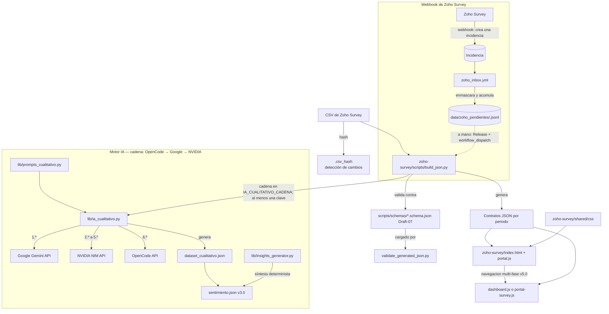

# Arquitectura Del Sistema De Encuestas De Satisfaccion

Este documento es la fuente canonica para entender la estructura tecnica de `survey-test`. Los contratos de datos viven en `CONTRACTS.md` y formalmente en `zoho-survey/scripts/schemas/*.schema.json`; las reglas para agentes viven en `AGENTS.md`.

## Mapa De Componentes



## Estructura De Directorios

```text
survey-test/
├── .github/workflows/       # Workflows de CI/CD (build_zoho_survey.yml, tests.yml, zoho_inbox.yml).
├── data/                    # CSVs de trabajo (ignorados) + bandeja de entrada del webhook de Zoho en data/zoho_pendientes/ (esa sí se versiona).
├── docs/                    # Documentacion y guias del proyecto.
├── tests/                   # Mini-framework de pruebas unitarias en navegador.
├── zoho-survey/             # Aplicacion estatica principal.
│   ├── index.html           # Portal v5.0 publicado en GitHub Pages (multi-fase).
│   ├── health.html          # Pagina de health check de contratos JSON por periodo.
│   ├── shared/              # Recursos compartidos (CSS, JS, imagenes).
│   │   ├── css/             # Capas CSS (tokens, reset, layout, components, sections, loader) + portal/.
│   │   └── js/              # Modulos JS IIFE expuestos en window.Survey* + portal/.
│   ├── template/            # Plantilla HTML para dashboards de periodo.
│   ├── scripts/             # ETL en Python, validacion de contratos y schemas.
│   │   ├── lib/             # 13 modulos activos del ETL (motor legacy eliminado en v3.2.0).
│   │   ├── schemas/         # JSON Schemas Draft-07 (8 schemas formales).
│   │   ├── config/          # Configuracion estatica (contexto_universidad.json).
│   │   └── tests/           # Tests Python (10 modulos).
│   └── students/            # Dashboards y JSONs generados por nivel y periodo.
├── AGENTS.md                # Reglas y principios operativos para IA.
├── ARCHITECTURE.md          # Arquitectura tecnica global (este documento).
└── CONTRACTS.md             # Contratos CSV/JSON e invariantes de datos.
```

Para mayor detalle de responsabilidades:

| Ruta | Responsabilidad |
| --- | --- |
| `data/` | CSVs fuente exportados desde Zoho Survey (sanitizados en CI). |
| `zoho-survey/scripts/` | Scripts ETL, validacion de contratos y schemas de datos. |
| `zoho-survey/scripts/lib/` | Biblioteca de utilidades modularizadas del ETL (13 modulos activos). |
| `zoho-survey/scripts/schemas/` | JSON Schemas Draft-07 (fuente formal de tipos). |
| `zoho-survey/shared/js/` | Modulos compartidos del portal y dashboard (IIFE). |
| `zoho-survey/shared/css/` | Capas CSS modulares e imports del dashboard. |
| `zoho-survey/template/` | Template base HTML para la generacion automatica de periodos. |
| `zoho-survey/students/` | Dashboards y datos JSON generados de estudiantes. |
| `tests/` | Infraestructura y tests unitarios de navegador. |
| `.github/workflows/` | Automatizacion de build, validacion y deploy en GitHub Pages, mas la bandeja de entrada `zoho_inbox.yml` que recibe las respuestas empujadas por Zoho Survey. |

## Pipeline De Datos

`zoho-survey/scripts/build_json.py` (856 lineas) transforma CSVs en contratos JSON estaticos. Delega en los siguientes submodulos en `scripts/lib/`:

### Modulos ETL (12 activos)

| Modulo | Lineas | Responsabilidad | Estado |
| --- | --- | --- | --- |
| `lib/config.py` | 485 | Mapeos de columnas, catalogos de negocio y constantes del motor IA. | Activo. |
| `lib/metrics.py` | 98 | Funciones puras de calculo de NPS (`calc_nps`), CSAT (`calc_csat`) y Promedio Ponderado. | Activo. |
| `lib/io_helper.py` | 227 | I/O seguro con encodings alternativos, formateo de fechas, hash para idempotencia, y redaccion PII (`enmascarar_pii`). | Activo. |
| `lib/zoho_respuesta.py` | 155 | Normaliza la respuesta que empuja el webhook de Zoho Survey: identificador de respuesta, encuesta (categoría + periodo), enmascarado de datos personales **antes** de guardar y descarte de duplicados. | Activo (Fase 1 de ingesta por webhook). |
| `lib/ia_cualitativo.py` | 558 | Orquestador del analisis cualitativo por **cadena de motores** (OpenCode -> Google -> NVIDIA), retirado el motor unico DeepSeek en v3.9.0 (motor legacy eliminado en v3.2.0). Deduplicacion por ID de comentario (sin cache). Umbral fail-closed: aborta si mas del 20% de los comentarios falla por API (`IA_CUALITATIVO_MAX_FALLOS_API_PCT`). | Activo (requiere al menos una clave de motores IA). |
| `lib/prompts_cualitativo.py` | 779 | Prompts exactos para los motores IA (system + user). Fuente de verdad de los prompts usados en el ETL. | Activo (Fase IA). |
| `lib/insights_generator.py` | 262 | Generador de insights deterministas (sin LLM). Produce `insights_ia.global` y `insights_ia.por_categoria_padre` a partir de datos ya procesados. | Activo. |
| `lib/csv_exporter.py` | 169 | Exportacion de CSVs y ZIPs con proteccion formula injection y redaccion PII. ZIPs se guardan en `exports/` (no desplegados en Pages). | Activo. |
| `lib/dashboard_builder.py` | 57 | Ensamblado de `dashboard_data.json` desde metricas pre-calculadas. | Activo. |
| `lib/periodos_updater.py` | 58 | Actualizacion de `periodos.json` por nivel, marcando `isNew: true` en el mas reciente. | Activo. |
| `lib/ia_client.py` | 423 | Cliente de la cadena de motores (Google Gemini, NVIDIA NIM, OpenCode; urllib stdlib) con reintentos, backoff exponencial y limite de ritmo por motor. Orden y modelos configurables con `IA_CUALITATIVO_CADENA` (por defecto: `opencode:deepseek-v4.1-flash` -> Google -> NVIDIA). | Activo. |
| `lib/ia_filtro_ruido.py` | 147 | Pre-filtro de comentarios ruidosos (15 criterios regex) antes de llamar a los motores IA. | Activo. |
| `lib/ia_validacion.py` | 263 | Validacion y correccion de respuestas de los motores IA. Redaccion PII post-LLM. | Activo. |

**Modulos eliminados en v3.2.0** (motor legacy): `lib/nlp.py`, `lib/segmentacion_nps.py`, `lib/aspect_extraction.py`, `lib/sentiment_engine.py`, `lib/sentimiento_builder.py`, `lib/ia_cache.py` (eliminado en limpieza Fase 0; reemplazado por deduplicacion por ID).

### Flujo cualitativo (v3.9.0) — Cadena de motores IA

Desde v3.9.0 el ETL usa una **cadena ordenada de motores IA** (OpenCode -> Google -> NVIDIA),
configurable con `IA_CUALITATIVO_CADENA`: si un motor falla o no valida su respuesta, se pasa al
siguiente. Basta con que UNA clave de la cadena este configurada. El motor legacy
(spaCy + sentence-transformers) fue eliminado en v3.2.0.

```
Comentario NPS (CSV)
    |  se intentan los motores en orden hasta que uno responda (15 workers; 60 RPM por motor, 15 en NVIDIA)
    v
ia_cualitativo.py → motores de la cadena (Google / NVIDIA / OpenCode)
    |  ejecuta 5 tareas en conjunto con coherencia de contexto:
    |  1. Segmentación en Meaning Units (Bardin, 2011)
    |  2. Clasificación de sentimiento con reglas de sesgo por contexto NPS
    |  3. Asignación de intensidad (1-5)
    |  4. Clasificación contra taxonomía oficial (Braun & Clarke, 2006)
    |  5. Triangulación con calificación CSAT por dimensión (cross-reference)
    v
dataset_cualitativo.json (intermedio ETL)
    |
    v
sentimiento.json v3.0 + insights_ia (vía insights_generator.py)
```

**Deduplicacion por ID (sin cache IA):** en lugar de un cache oculto (`ia_cache.json`,
eliminado), `build_json.py` usa `sentimiento.json` como fuente de verdad: si un comentario
ya fue procesado (su ID esta en el JSON existente), se salta. Solo se envian a los motores IA los
comentarios NUEVOS. Para forzar reprocesamiento, borrar el `sentimiento.json` del periodo.

### Optimizacion: deteccion de cambios por hash

`build_json.py` implementa una optimizacion de skip: antes de procesar un CSV, calcula su hash SHA256 y lo compara con `.csv_hash` (guardado en el directorio de salida del periodo). Si el CSV no cambio desde el ultimo build Y todos los JSONs ya existen, se salta el reprocesamiento completo. Esto ahorra tiempo de CPU, llamadas a los motores IA (costos), y reescritura de archivos identicos. La huella es versionada (`ETL_OUTPUT_VERSION` + hash) para forzar reproceso controlado cuando cambian reglas internas.

### Outputs generados por periodo

El ETL genera archivos en `zoho-survey/students/{level}/{period}/`:

En `json/` (consumidos por frontend):
1. `dashboard_data.json` (v2.0) — KPIs ejecutivos, hallazgos, distribuciones NPS/CSAT.
2. `dimensiones.json` — agregados por facultad/carrera/ciclo/categoria/dimension.
3. `ids.json` — conteos por facultad/carrera/ciclo.
4. `nps_ciclo_carrera.json` — NPS por carrera y ciclo.
5. `csat_ciclo_carrera.json` — CSAT por carrera y ciclo.
6. `filtros.json` (v2.0) — opciones de filtros en cascada.
7. `sentimiento.json` (v3.0) — analisis cualitativo completo (consumido por frontend).
8. `nps_carrera.json` (legacy) — NPS por carrera (fallback para encuestas sin ciclo).
9. `csat_carrera.json` (legacy) — CSAT por carrera (fallback para encuestas sin ciclo).

En `intermediate/` (no consumidos por frontend):
10. `fragmentos_nps.json` — Meaning Units extraidas.
11. `dataset_cualitativo.json` — dataset detallado de fragmentos clasificados por los motores IA.

Adicionalmente:
- `json/.csv_hash` — huella versionada del CSV fuente (deteccion de cambios).
- `exports/` — ZIP con CSVs de auditoria (NO se despliegan en GitHub Pages).
- Por nivel: `periodos.json` (actualizado con `isNew: true` en el mas reciente).
- Por periodo: `index.html` copiado desde `template/` con `{{SHARED_PATH}}` reemplazado.

### Responsabilidades del ETL

- Normalizar columnas de Zoho Survey a nombres internos definidos en `lib/config.py`.
- Calcular agregados NPS, CSAT y empleabilidad cuando corresponde.
- Generar datos por facultad, carrera, ciclo y dimension.
- Enviar comentarios NPS a los motores IA para analisis cualitativo (sentimiento, intensidad, aspectos, categoria).
- Copiar el template del periodo y actualizar `periodos.json`.
- Mantener idempotencia: correr el script dos veces con la misma entrada debe producir el mismo resultado (con caveat: si el CSV no tiene fechas validas, se usa `pd.Timestamp.now()` como fallback, lo que rompe idempotencia en ese edge case).

Los esquemas, archivos requeridos e invariantes estan definidos en `CONTRACTS.md` y formalmente en `zoho-survey/scripts/schemas/*.schema.json` (8 schemas Draft-07).

## Validacion

`zoho-survey/scripts/validate_generated_json.py` valida los JSONs generados aplicando:

1. **JSON Schema Draft-07** (fuente formal de tipos): carga cada schema desde `scripts/schemas/` y ejecuta `Draft7Validator.iter_errors()`.
2. **Invariantes de negocio cruzadas** (no expresables en JSON Schema): suma total > 0, `facultad_carrera` cubre todas las facultades, al menos una fila con `total > 0` en `dimensiones.json`, exactamente un `isNew: true` en `periodos.json`.
3. **Validacion de HTML del periodo**: verifica que cada `index.html` contenga los fragmentos requeridos para la seccion cualitativa.

El validador NO debe ser mas permisivo que el schema. Si el schema rechaza, el validador rechaza.

## Frontend

La aplicacion es una SPA estatica en Vanilla JS, sin backend ni dependencias runtime.

### Portal (v5.0)

- `zoho-survey/index.html`: entrada publicada en GitHub Pages. Portal multi-fase (Estudiantes Pregrado/Posgrado, Graduados, Egresados, Docentes, Personal, Empleadores).
- `zoho-survey/shared/js/portal.js`: orquestador del portal (init, renderSidebar, navegacion de fases).
- `zoho-survey/shared/js/portal/`: 5 modulos de vista:
  - `portal-data.js` — carga y normalizacion de datos (SurveyPortalCore + SurveyPortalData).
  - `portal-dashboard.js` — tarjetas de satisfaccion por fase + barra NPS.
  - `portal-survey.js` — vista 1.0: KPIs, distribuciones CSAT/NPS, hallazgos, top3, radar, tabla detalle.
  - `portal-filters.js` — filtros en cascada por grupo (top3/radar/detalle).
  - `portal-radar.js` — grafico radar SVG del portal.
- NO usa iframes: renderiza directamente los JSONs de cada periodo.

### Dashboard (por periodo)

- `zoho-survey/template/index.html`: estructura HTML base de cada periodo.
- `zoho-survey/shared/js/dashboard.js`: orquestador principal (1.270 lineas).
- `zoho-survey/shared/js/config/constants.js`: metas, ciclos y constantes compartidas.
- `zoho-survey/shared/js/utils/`: `formatters.js` (formateo es-PE), `metrics.js` (calculos), `sanitizer.js` (XSS), `dom-helpers.js` (utilidades DOM).
- `zoho-survey/shared/js/components/`:
  - `tooltip.js`: Globos interactivos flotantes.
  - `progress-bar.js`: Barra superior de scroll de pagina.
  - `custom-select.js`: Selectores desplegables personalizados.
  - `multiselect.js`: Listas de seleccion multiple.
  - `filter-controller.js`: Coordinacion de filtros en cascada (Facultad/Carrera/Ciclo).
  - `radar-chart.js`: Grafico radar dinamico en SVG nativo (sin librerias externas).
  - `sentiment-view.js`: Renders cualitativos y comentarios NPS (1.036 lineas, v3.0.0).

Los modulos usan IIFE y exponen APIs globales `window.Survey*`. No usan ES Modules.

### Orden de carga de scripts

El orden de carga es critico y debe respetarse. Verificado por `zoho-survey/scripts/tests/test_html_contract.py`.

**Template** (`template/index.html`, 13 scripts):

1. `config/constants.js` → 2. `utils/formatters.js` → 3. `utils/metrics.js` → 4. `utils/sanitizer.js` → 5. `utils/dom-helpers.js` → 6. `components/tooltip.js` → 7. `components/progress-bar.js` → 8. `components/custom-select.js` → 9. `components/multiselect.js` → 10. `components/filter-controller.js` → 11. `components/radar-chart.js` → 12. `components/sentiment-view.js` → 13. `dashboard.js`.

**Portal** (`index.html`, 14 scripts):

1. `config/constants.js` → 2. `utils/sanitizer.js` → 3. `components/tooltip.js` → 4. `utils/dom-helpers.js` → 5. `utils/formatters.js` → 6. `components/sentiment-view.js` → 7. `components/custom-select.js` → 8. `components/multiselect.js` → 9. `portal/portal-data.js` → 10. `portal/portal-dashboard.js` → 11. `portal/portal-radar.js` → 12. `portal/portal-filters.js` → 13. `portal/portal-survey.js` → 14. `portal.js`.

> **Advertencia:** `dom-helpers.js` debe cargarse **siempre antes** que `custom-select.js` para evitar errores `TypeError: window.SurveyDomHelpers is undefined`.

## CSS

`zoho-survey/shared/css/` contiene:

- `tokens.css`: design tokens y variables CSS (colores institucionales, tipografia, espaciados, z-index, radios, sombras).
- `reset.css`: reset y utilidades base (`.skip-link`, `.sr-only`).
- `layout.css`: header, navegacion, grid y footer.
- `components.css`: KPIs, filtros, barras, tooltips y tablas (la capa mas grande).
- `sections.css`: secciones, responsive y ajustes visuales.
- `portal/`: `portal-base.css`, `portal-components.css`, `portal-sections.css` (estilos del portal v5.0).

`dashboard.css` fue eliminado en v3.2.0 (CSS muerto; los imports viven en las capas base).
`loader.css` fue eliminado en Fase 2 junto con `loader.js` (navegador de encuestas legacy, sin consumidores).

## Patrones Arquitectonicos

- **Datos precomputados**: el frontend consume JSON, no recalcula agregados que pertenecen al ETL.
- **Separacion de datos y vista**: los JSON no deben depender del layout visual.
- **Delegacion progresiva**: `dashboard.js` delega en modulos compartidos cuando existen; mantiene fallback inline para KPIs, distribuciones y tablas detalladas.
- **Compatibilidad backward**: los contratos legacy se conservan cuando todavia hay consumidores (ej. `nps_carrera.json`/`csat_carrera.json` como fallback para encuestas sin ciclo).
- **Degradacion controlada**: errores de carga JSON opcionales se tratan con `console.warn` sin romper toda la pagina. Endpoints criticos (`dashboard_data`, `filtros`, `dimensiones`) fallan rapido via `Promise.all`.
- **Resolucion de dependencias en runtime**: los modulos IIFE referencian `window.Survey*` al momento de uso, no al de carga. Esto permite que el dashboard funcione aunque falten modulos opcionales.

## Seguridad

- Cualquier contenido externo usado en HTML debe pasar por `escapeHTML()` o `sanitizeHTML()`.
- `sanitizeHTML()` permite solo una lista reducida de etiquetas necesarias para tooltips y textos enriquecidos: `br, strong, em, i, span, table, tr, td, th` (9 tags, sin atributos).
- No introducir dependencias runtime para sanitizacion sin justificar el costo operacional.

## Ingesta De Encuestas

Tres caminos, sin credenciales en el navegador:

1. **Webhook de Zoho Survey** (acumular): cada respuesta crea una incidencia; `zoho_inbox.yml` la normaliza, la **enmascara** y la guarda en `data/zoho_pendientes/<encuesta>.jsonl`. No corre el ETL. La incidencia se cierra al registrarse.
2. **Release + `workflow_dispatch`** (procesar): el CSV se adjunta a un Release y se lanza *Build and Deploy Survey* con `release_tag`. El ETL corre en Actions.
3. **Botón de refrescar del portal** (pedir el proceso): el botón llama a `POST /api/procesar-encuesta` en Vercel, que guarda la llave y dispara `repository_dispatch: procesar_datos` sobre *Build and Deploy Survey*, que convierte la bandeja en el CSV y ejecuta el ETL. El ETL sigue condicionado al gate de CSVs, así que un disparo sin CSV solo redespliega el sitio.

El portal (`zoho-survey/index.html`) es **solo lectura**: no pide credenciales. Su botón de refrescar hace dos cosas: pide el proceso (camino 3) y vuelve a leer los datos publicados. La llave de GitHub vive en Vercel, nunca en el navegador.

### Flujo

```mermaid
graph TD
    REL[Release con tag (DRAFT)] -->|workflow_dispatch release_tag| ACT[GitHub Actions]
    ACT -->|download| DATA[data/]
    DATA --> SAN[sanitize_csv_pii.py]
    SAN --> ETL[build_json.py]
    ETL --> DEPLOY[deploy Pages]
    DEPLOY -->|borra los CSV| OK[Done]
```

Pasos del procesamiento:
1. El owner adjunta el CSV al Release y lanza el workflow con `release_tag`.
2. `gh release download` baja el CSV a `data/` (solo en el runner; nunca al historial).
3. `sanitize_csv_pii.py --all` redacta IP/UA/URL in-place.
4. `build_json.py` procesa (ver "Procesamiento ETL"), se validan los contratos JSON y se despliega a Pages.
5. Los CSV se borran antes del commit del bot (fail-closed: si alguno queda en staging, el commit aborta). El Release **no** se elimina.

> **Conversión:** cuando el disparo viene del portal, `zoho-survey/scripts/zoho_a_csv.py` arma el CSV desde
> `data/zoho_pendientes/` (una fila por respuesta, cabeceras del ETL, nombre derivado del título) y el gate de CSVs lo recoge.
> La bandeja no se borra: es el acumulado del periodo.

### Especificaciones del Release de entrada

| Característica | Valor |
| --- | --- |
| Tipo | GitHub Release con el CSV adjunto (no hay carpeta temporal) |
| Visibilidad | **DRAFT** mientras se procesa (repo público) |
| Descarga | `gh release download <tag> --pattern '*.csv' --dir data/`, solo en el runner |
| Codificación aceptada | UTF-8; fallback Latin-1 (`read_csv_robust`) |
| Eliminación | el Release **no** se elimina: es del owner |
| Ventana de PII | solo durante download→sanitize→ETL; IP/UA/URL redimidos antes del ETL y los CSV borrados antes del commit |

### Reglas de nombres CSV — CANON

Las reglas de nombre y las headers obligatorias viven en **`CONTRACTS.md`** (sección "Reglas de nombres CSV"). Consecuencia técnica: `build_json.py` deriva el **nivel** y el **periodo** del nombre del archivo, así que un nombre fuera de esas reglas no se procesa.

### Procesamiento ETL (Fase 2) - 7 categorias

build_json.py procesa las 7 categorias. resolver_config_etl (lib/config.py) resuelve por nivel la columna de identidad, CSAT (empleadores carece de ella -> ceros), ciclo (solo estudiantil pregrado) y facultad. Las dimensiones de los 5 niveles nuevos se auto-detectan por escala Likert (_detectar_dimensiones + clasificar_categoria_dimension).


### Auth

- **Sin credenciales en el navegador**: el portal solo lee los JSON publicados en Pages (no hay PAT en el cliente).
- **Zoho → GitHub**: el webhook usa un PAT (Personal Access Token - Token de Acceso Personal) fine-grained con permiso *Issues: write*, guardado en la cabecera del webhook dentro de Zoho (nunca en el repositorio).
- **GitHub Actions**: usa el `GITHUB_TOKEN` del propio flujo.
- **Portal → GitHub**: el disparo pasa por `POST /api/procesar-encuesta`, en el proyecto Vercel de `survey-tracker`. La llave es un PAT (Personal Access Token - Token de Acceso Personal) fine-grained con permiso *Contents: Read and write* sobre este repositorio, guardada como variable de entorno `GITHUB_DISPATCH_TOKEN`; el navegador no la recibe nunca.

### PII (puntos 2-6 de la auditoría Fase 3.7)

| # | Dónde puede aparecer | Estado en Arquitectura A |
| --- | --- | --- |
| 1 | Comentario NPS hacia los motores IA | 🔴 Ofuscado con `ofuscar_pii_para_llm` (Fase 3.5) antes del LLM |
| 2 | PII en la bandeja de entrada | 🟢 Cero — la respuesta se **enmascara antes** de escribirla en `data/zoho_pendientes/` |
| 3 | PII en Git | 🟢 Cero — `data/` está ignorado; los CSV se borran antes del commit del bot |
| 4 | PII publicada en Pages | 🟢 Cero — solo JSON/HTML sanitizados |
| 5 | PII en logs de Actions | 🟢 Cero — los steps registran nombre de archivo, no contenido |
| 6 | PII en artifacts | 🟢 Cero — artifact publicado excluye `exports/` e `intermediate/` |

Los CSV de prueba con IP están cubiertos por `sanitize_csv_pii.py` (redime `Dirección IP`, `Agente Usuario`, `URL de la encuesta`). La única PII sensible identificada en la ingesta es la **dirección IP**.

### Concurrencia

- `concurrency.group: deploy-${{ github.ref }}`, `cancel-in-progress: false` → una sola corrida de build/ETL por rama (dos corridas no se pisan al commitear los JSON).
- La ingesta (`zoho_inbox.yml`) tiene su propio grupo: varias respuestas seguidas se apilan sin pisarse.

### Errores y reintentos

- Un motor falla o no valida su respuesta → se pasa al siguiente de la cadena; cada motor reintenta con backoff (`ia_client.js`/`ia_client.py`).
- Validate/JSON/Deploy falla → el job falla y el commit del bot no corre; recovery manual.
- Ingesta: si el cuerpo de la incidencia no es JSON válido, el flujo falla y la incidencia queda **abierta** como aviso.


## Deuda Tecnica Vigente

- La logica de ciclos esta externalizada en `SURVEY_CONFIG`, pero todavia no es dinamica por periodo.
- `nps_carrera.json` y `csat_carrera.json` son legacy; el frontend los usa como fallback para encuestas sin ciclo (`has_ciclo=false`, ej. Graduados).
- `postgraduate/` y los directorios de niveles sin datos (`alumni/`, `employers/`, `faculty-staff/`, `nonfaculty-staff/`) existen como placeholders sin datos procesados.
- El template `zoho-survey/template/index.html` no tiene version de contrato propia.
- El portal y el dashboard por periodo renderizan vistas similares con codigo parcialmente duplicado (`portal/*.js` vs `components/*.js` + `dashboard.js`); unificar en una sola fuente es deuda planificada.

## Convenciones

- **JavaScript**: camelCase para variables y funciones; APIs compartidas bajo `window.Survey*`.
- **CSS**: kebab-case para clases e IDs; usar tokens antes que valores hardcodeados.
- **Python**: snake_case para funciones y variables; constantes en UPPER_SNAKE_CASE.
- **JSON**: claves NPS en minusculas (`promotores`, `pasivos`, `detractores`); claves CSAT capitalizadas (`Totalmente satisfecho`, etc.) por provenir del catalogo Zoho.
- **Compatibilidad**: GitHub Pages, navegadores modernos y Python para ETL.
